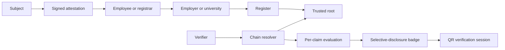

# Sweesh API and Architecture

Sweesh is a verifiable-credential demo for checking claims about a person without treating an entire resume as one indivisible badge.

The system evaluates each claim independently, follows delegated authority chains to verifier-selected roots, and supports selective disclosure through signed badges.

## Running the API

From `demo-app`:

```powershell
npm install
$env:PORT="4001"
node server.js
```

The API is then available at:

```text
http://localhost:4001/api
```

The visualisation is available at:

```text
http://localhost:4001/
```

## Architecture



### Components

| Component | File | Responsibility |
|---|---|---|
| HTTP server | `server.js` | Serves the visualisation and mounts the API. |
| API routes | `src/api/routes.js` | Resume, registry, badges, QR sessions, revocation, and adversarial endpoints. |
| Cryptography | `src/core/crypto.js` | Ed25519 keys, `did:key` identifiers, canonical JSON, signatures, hashes, and nonces. |
| Registry | `src/core/registry.js` | Entities, accreditations, attestations, relationships, and revocations. |
| Claim paths | `src/core/paths.js` | Path matching and monotonic scope containment. |
| Resolver | `src/core/resolve.js` | Walks an attester to a verifier-trusted root and checks every hop. |
| Evaluator | `src/core/evaluate.js` | Converts evidence into authoritative, corroborative, self-asserted, or unverified states. |
| Badges | `src/core/badge.js` | Builds and verifies audience-bound selective-disclosure badges. |
| Demo seed | `src/demo/seed.js` | Creates the sample resume, entities, delegations, and attestations. |

## Claim States

Every claim is evaluated separately:

- **Authoritative**: a valid attestation reaches a trusted root through a complete delegation chain.
- **Corroborative**: independent peers support the claim, but no authoritative chain reaches a trusted root.
- **Self-asserted**: the subject made the claim and it is bound to them, but nobody else backs it.
- **Unverified**: no valid evidence remains.

Confidence is calculated by the evaluator. It considers chain depth, co-signers, peer overlap, corroborator independence, and reciprocal-only corroboration rings.

## API Reference

All endpoints below are relative to `/api`.


### Demo metadata

```http
GET /demo/overview
```

Returns the current subject, registry counts, supported capabilities, and explicitly unimplemented production features.

### Resolved resume

```http
GET /resume
GET /resume?roots=root:ugc,root:usde
```

Returns every seeded claim with its computed state, confidence, signers, peers, authority chain, claims, and failure information.

The visualisation calls this endpoint on load.

### Individual claim

```http
GET /claims/:claimPath
```

Example:

```http
GET /claims/education.nyu.degree
```

Returns the full evaluation for one claim, including the attempted authority chain.

### Direct chain resolution

```http
POST /resolve
Content-Type: application/json
```

Request:

```json
{
  "entityId": "person:nyu-registrar",
  "claimPath": "education.nyu.degree",
  "roots": ["root:usde"],
  "at": "2026-09-19T12:00:00.000Z"
}
```

The resolver checks whether the entity can attest the path under the selected roots at the requested time.

## Badge API

### Build a badge

```http
POST /badges/build
Content-Type: application/json
```

Request:

```json
{
  "claimPaths": [
    "education.nyu.degree",
    "employment.qualcomm.work.codebuddy"
  ],
  "disclose": {
    "education.nyu.degree": ["institution", "award"],
    "employment.qualcomm.work.codebuddy": ["statement", "tools"]
  },
  "audience": "employer:acme",
  "expiresAt": "2026-10-01T00:00:00.000Z"
}
```

The resulting badge is signed by the subject and contains only the selected fields. Other fields and claim paths are marked as withheld.

### Verify a badge

```http
POST /badges/verify
Content-Type: application/json
```

Request using a badge ID:

```json
{
  "badgeId": "badge_abc123",
  "audience": "employer:acme"
}
```

Or send the complete badge in the `badge` property.

Verification checks the holder signature, audience, expiration, invalidation status, and the current status of every included claim. Claims are re-resolved so later revocations are visible.

### Invalidate a badge

```http
POST /badges/:badgeId/invalidate
```

Invalidates one badge without revoking the underlying attestations.

## QR Room Verification

### Create a room session

```http
POST /room/sessions
Content-Type: application/json
```

Request:

```json
{
  "baseUrl": "http://192.168.1.20:4001",
  "claimPaths": [
    "education.nyu.degree",
    "employment.qualcomm.work.codebuddy"
  ],
  "disclose": {
    "education.nyu.degree": ["institution", "award"],
    "employment.qualcomm.work.codebuddy": ["statement"]
  }
}
```

Response fields include:

- `sessionId`: short identifier for the room session.
- `verifyUrl`: URL encoded in the QR code.
- `qrDataUrl`: QR image as a data URL.
- `claimCount`: number of included claims.

The presenter view creates this session with the **verify by QR** control.

### Verify a room session

```http
GET /room/sessions/:sessionId
```

The attendee page is:

```text
/verify.html?session=SESSION_ID
```

Each attendee receives the disclosed claims and their current independent verification result.

## Registry API

```http
GET /registry/roots
GET /registry/entities
GET /registry/accreditations
GET /registry/attestations
```

These endpoints expose the demo registry, including entity identities, accreditation scopes, validity windows, signatures, and revocation status.

## Revocation and Demo Controls

Revoke an accreditation or attestation:

```http
POST /revoke
Content-Type: application/json
```

```json
{
  "id": "acc_12345",
  "reason": "issuer accreditation withdrawn"
}
```

Restore a revoked record:

```http
POST /unrevoke
Content-Type: application/json
```

```json
{
  "id": "acc_12345"
}
```

Reset the seeded demo:

```http
POST /demo/reset
```

Run the adversarial verification suite:

```http
GET /adversarial
```

The suite covers 12 attack vectors, including expired links, revoked links, scope widening, cycles, depth overruns, subject-line violations, badge replay, wrong roots, and retired keys.

## Trust and Security Mechanics

### Cryptography

The crypto layer uses Node's built-in Ed25519 implementation. Payloads are canonicalised before signing so object key order does not change the signed bytes.

Entities receive `did:key` identifiers derived from their public keys. Accreditations and attestations contain issuer signatures and can be independently checked by the registry.

### Delegated authority

An authoritative chain has this shape:

```text
attester -> institution or employer -> register -> trusted root
```

At every hop the resolver checks:

- Accreditation signature validity
- Accreditation validity window
- Revocation
- Scope coverage
- Monotonic scope attenuation
- Delegation depth
- Subject/reporting-line constraints
- Cycles
- Retired signing keys

A claim is authoritative only if the chain reaches a root selected by the verifier.

### Claim-path scopes

Scopes use paths such as:

```text
employment.qualcomm.work.codebuddy
employment.*.work.**
```

Supported patterns:

- Literal segments
- `*` for exactly one segment
- `**` for zero or more trailing segments

A child delegation may narrow its parent's scope but may not widen it. Parent exclusions must remain excluded and can only grow downstream.

### Selective disclosure

The subject chooses which claim paths and fields to reveal. A badge contains:

- Subject identifier
- Audience
- Nonce
- Expiration
- Selected claim results
- Disclosed fields
- Withheld fields and paths
- Holder signature

The badge does not reveal the full resume by default.

## Static GitHub Pages Mode

GitHub Pages cannot run the Node/Express API. The Pages workflow therefore runs:

```powershell
npm run build:pages
```

That command uses the same seeded core and writes resolver-derived data to:

```text
Sweeesh/visualisation/resume.json
```

The visualisation first tries `/api/resume`. If the API is unavailable, it loads `./resume.json` instead.

The static Pages version can display the resolved demo, but live QR sessions, mutations, revocation, and API calls require the Node server.

## Current Limitations

This is a working demonstration rather than a production credential network. The following are not implemented yet:

- Persistent database storage
- Distributed registry
- Merkle transparency log
- Zero-knowledge proofs
- SD-JWT VC or W3C VC 2.0 wire format
- Production DID resolution
- Production key custody
- Persistent cross-device room sessions

The current seeded registry and QR sessions are held in memory and reset when the server restarts.

## Validation

Run the automated tests with:

```powershell
npm test
```

The current suite covers:

- Resolver-derived resume states
- Per-claim degradation after revocation
- Audience and holder binding
- All 12 adversarial vectors
